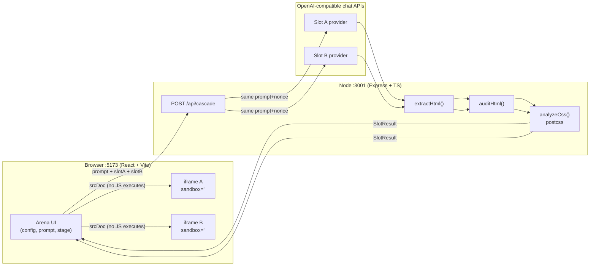

# 🌊 Cascade — Pure-CSS Model Arena

**Two models. One prompt. Zero JavaScript. Nowhere to hide.**

Cascade sends the *identical* prompt to two model slots (A = older, B = newer):

> *"Build an animated [X] using ONLY HTML and CSS. No JavaScript, no SVG, no images,
> no external assets, no libraries. Output only one Original complete HTML file."*

Both replies render side-by-side in `<iframe sandbox="">` — an **empty sandbox
attribute, so JavaScript is disabled at the browser level**. A reply that cheats with
JS doesn't error, doesn't warn — it just sits there, visibly frozen, while its
sibling dances. A server-side compliance audit then disqualifies it *openly* in the UI.
The result is a screen-recordable, visual proof of model progression under a
constraint that leaves nowhere to hide. Built for YouTube and Instagram.

https://github.com/user-attachments/assets/65065ceb-e827-4a70-afa5-f2b271c687b4


---

## Table of contents

- [How it works](#how-it-works)
- [Architecture](#architecture)
- [Tech stack](#tech-stack)
- [Project structure](#project-structure)
- [Quickstart](#quickstart)
- [Configuration](#configuration)
- [API reference](#api-reference)
- [The compliance audit](#the-compliance-audit)
- [HTML extraction](#html-extraction)
- [Reasoning-token honesty](#reasoning-token-honesty)
- [The preview stage](#the-preview-stage)
- [Verification protocol](#verification-protocol)
- [Fork & contribute](#fork--contribute)
- [Feature ideas](#feature-ideas)
- [Security notes](#security-notes)

---

## How it works

```
You type a subject ("a beating heart")
        │
        ▼
POST /api/cascade ──► identical prompt + identical nonce ──► Slot A & Slot B (concurrent)
        │
        ▼
Server extracts HTML → audits bytes → parses CSS (postcss) → SHA-256
        │
        ▼
Two sandbox="" iframes render with JS disabled · badges · chips · stats
```

The magic is the constraint: CSS animations (`@keyframes`, transitions) run fine
without JavaScript, but `setInterval`-driven motion does not. The medium *is* the test.

---

## Architecture



**Why the backend makes every model call.** Browsers can't reach
`http://127.0.0.1:11434` (Ollama) or `:1234` (LM Studio) without CORS fights, and API
keys must never ship to the client. The Express server is a thin, honest broker: it
forwards OpenAI-compatible `/chat/completions` requests, then audits what came back.
The Vite dev server proxies `/api → http://localhost:3001`, so the frontend needs no
URL configuration:

```ts
// frontend/vite.config.ts
export default defineConfig({
  plugins: [react()],
  server: {
    port: 5173,
    proxy: { "/api": "http://localhost:3001" },
  },
});
```

---

## Tech stack

| Layer    | Technology | Why |
|----------|-----------|-----|
| Frontend | **Vite 5 + React 18 + TypeScript** | Fast dev loop, component stage UI |
| Styling  | Hand-written CSS (`styles.css`) | Big readable type for screen recording; no framework needed |
| Backend  | **Node 26 + Express 4 + TypeScript** | Minimal broker + audit; `fetch` is built-in |
| CSS parsing | **postcss** (server-side) | Real parser for rule counts + animation chips — never hardcoded |
| Transport | `srcdoc` + `sandbox=""` iframes | JS disabled by the browser itself, not by promise |
| Dev UX   | npm workspaces + `concurrently` | One `npm run dev` boots server + web |

Deliberately **absent**: three.js, canvas, animation libraries, SVG, images, auth,
databases, conversation history — all non-goals.

---

## Project structure

```
Cascade/
├── package.json              # workspaces + `dev` (concurrently: server + web)
├── README.md                 # you are here
├── docs/
│   ├── BLOG.md               # technical deep-dive
│   └── SOCIAL.md             # X thread + LinkedIn post
├── server/
│   ├── package.json          # express, cors, postcss, tsx, typescript
│   └── src/
│       ├── index.ts          # routes: /api/health, /api/models, /api/audit, /api/cascade
│       └── cascade.ts        # callSlot(), auditHtml(), extractHtml(), analyzeCss()
└── frontend/
    ├── vite.config.ts        # :5173 + /api proxy → :3001
    └── src/
        ├── types.ts          # SlotConfig, SlotResult, providers, presets, JS_POISON
        ├── App.tsx           # editors, stage, panes, slider, verify, export
        ├── styles.css        # dark arena theme, large type
        └── main.tsx
```

---

## Quickstart

```bash
npm install
npm run dev        # server :3001 · web http://localhost:5173
```

Paste API keys into the slot editors in the UI (persisted to `localStorage`, never
written to any file). For local models, just pick **Ollama** or **LM Studio** — no key
needed, no CORS configuration needed.

> **Port collision?** If `:3001` is taken by another app, run
> `PORT=30xx node server/dist/index.js` after
> `npm run build --workspace=cascade-server`. The default stays `3001` per spec.

---

## Configuration

Per slot: provider preset, base URL, API key, model name, temperature, max tokens,
and a *Disable reasoning* checkbox.

| Preset | Base URL | Key? | Models |
|--------|----------|------|--------|
| Particle.ai | `https://api.particle.ai/v1` | required | `deepseek-v4.1-flash`, `deepseek-v4-flash-0731`, `glm5.3flash` (+ type any name by hand) |
| Ollama | `http://127.0.0.1:11434/v1` | no | live from `GET /v1/models` — never hardcoded |
| LM Studio | `http://127.0.0.1:1234/v1` | no | live from `GET /v1/models` |
| OpenRouter | `https://openrouter.ai/api/v1` | required | live or typed |
| Custom | you type it | optional | typed |

Defaults: **A** = Particle.ai / `deepseek-v4-flash-0731`, **B** = Particle.ai /
`deepseek-v4.1-flash`, temperature `0`, max tokens `1600`. Note that
`deepseek-v4-flash-0731` does not appear in Particle.ai's `/models` list and still
responds — so the model field **always accepts typed names** and a run is never gated
on `/models` succeeding.

---

## API reference

### `POST /api/cascade`

```jsonc
// request
{
  "prompt": "Build an animated a beating heart using ONLY HTML and CSS…",
  "slotA": { "provider": "Particle.ai", "baseUrl": "https://api.particle.ai/v1",
             "apiKey": "…", "model": "deepseek-v4-flash-0731",
             "temperature": 0, "maxTokens": 1600, "disableReasoning": true },
  "slotB": { "...": "…" }
}
```

```jsonc
// response (per slot)
{
  "nonce": "bb56754ab4f6eaf8",
  "slotA": {
    "html": "<!DOCTYPE html>…",   // extracted, ready for srcdoc
    "rawReply": "…",              // full assistant text (reasoning_content stripped)
    "latencyMs": 8421,
    "promptTokens": 210, "completionTokens": 1180,
    "reasoningTokens": null,      // number, or null → UI shows "n/a"
    "sha256": "a4fb6774c9b91afb", // 16-hex-char prefix of the HTML bytes
    "violations": [],             // e.g. ["script tag (<script>)"]
    "disqualified": false,
    "extractionPath": "fence:```html",
    "cssRuleCount": 14, "domNodeCount": 9, "animationCount": 3,
    "chips": ["@keyframes beat", "animation", "transform", "filter"]
  },
  "slotB": { "…": "…" }
}
```

Both slots receive the **identical** user string — the server appends one fresh random
nonce per run to defeat silent response caches:

```ts
// server/src/index.ts
const nonce = crypto.randomBytes(8).toString("hex");
const promptWithNonce = `${prompt.trim()}\n\n<!-- cascade-run:${nonce} -->`;
const [ra, rb] = await Promise.all([
  callSlot(a, promptWithNonce, nonce),
  callSlot(b, promptWithNonce, nonce),
]);
```

The model-call core (`server/src/cascade.ts`) honors the provider capability rules:

```ts
const body: Record<string, unknown> = {
  model: slot.model,
  messages: [
    { role: "system", content: "You are a precise assistant. Answer the user's request directly." },
    { role: "user", content: promptWithNonce },
  ],
  temperature: slot.temperature ?? 0,
  max_tokens: maxTokens,
};
// Only Particle.ai + deepseek-* understands this field — others ignore or reject it.
if (slot.disableReasoning && isParticle && isDeepseek) {
  body.chat_template_kwargs = { enable_thinking: false };
}
```

And the empty-budget retry — an HTTP 200 with empty content means the hidden chain of
thought ate the budget, so we retry once with double, capped at 4000:

```ts
if (!content.trim()) {
  if (attempt === 0) { maxTokens = Math.min(maxTokens * 2, 4000); continue; }
  return { ...empty, error: "Empty content after retry…" };
}
```

A dead local server returns a message that names the problem, never "Something went wrong":

```ts
`Cannot reach http://127.0.0.1:11434 — is Ollama running? (fetch failed)`
```

### `GET /api/models?base_url=&api_key=`

Proxies `{base_url}/models` (merging preset static names for Particle.ai). Powers the
per-slot `<datalist>` — informational only.

### `POST /api/audit`

```bash
curl -X POST localhost:3001/api/audit \
  -H 'Content-Type: application/json' \
  -d '{"html":"<div onclick=evil()></div><script>…</script>"}'
# {"violations":["script tag (<script>)","on* event handler attribute"],
#  "disqualified":true,"badge":"DISQUALIFIED", …}
```

Used by the in-app **Verify constraint** button against a canned JS-poison sample.

---

## The compliance audit

`auditHtml()` runs server-side on the real HTML bytes *before* rendering. It flags:

- `<script>` tags → **disqualify**
- `on*` event-handler attributes (matched outside `<style>` blocks) → **disqualify**
- `javascript:` URLs
- ` <svg> <canvas> <video> <audio> <iframe> <object> <embed>` tags
- `@import` rules and remote `<link>`s
- `url()` pointing off-site (`http(s)://`, `//`, `data:`)

```ts
const disqualified =
  /<script[\s>]/i.test(html) ||
  /\son\w+\s*=/i.test(html.replace(/<\s*style[\s\S]*?<\/\s*style\s*>/gi, ""));
```

Disqualification is **reported in the UI** (red banner + `DISQUALIFIED` pill) — never hidden.

---

## HTML extraction

Models wrap code in fences, prose, apologies. `extractHtml()` prefers a
```` ```html ```` fence, falls back to a document containing `<html`/doctype, then
`<style`, then raw — and records which path was used (`extractionPath`), so you can
see *how* each reply was recovered.

---

## Reasoning-token honesty

Capability detection, never assumptions: the server reads
`usage.completion_tokens_details.reasoning_tokens` and nothing else. Absent (normal
for Ollama/LM Studio) → `null` → the UI renders **"n/a"** and hides the thinking
readout. It never prints `0`, never invents a number. The `reasoning_content` text
itself is dropped on the floor — never logged, displayed, or persisted.

---

## The preview stage

- **Headers** per pane: model name, HTML bytes, CSS rule count, DOM node count,
  animation/transition count, compliance badge (`CLEAN` / `VIOLATION` / `DISQUALIFIED`),
  latency, token counts, reasoning (`n/a` aware), SHA prefix, extraction path.
- **`JavaScript: DISABLED`** banner across the stage — a viewer instantly gets the constraint.
- **Animation chips**: parsed from the reply's real CSS with postcss
  (`animation`, `transform`, `filter`, `clip-path`, `conic-gradient`, `@keyframes …`…)
  — the "how" that makes the video watchable.
- **View modes**: side-by-side, plus a drag-divider **slider** for screen recordings.
- **Share card**: 1080×1080 PNG export, captured from the live iframes via the
  browser's own rendering (frozen current frames, not a re-draw).
- **Stages**: `idle → composing → auditing → rendering → finished / error`, with
  `Copy results as JSON` for receipts.

The sandbox is the whole point, and it's one attribute:

```tsx
<iframe className="preview" title="model-a" sandbox="" srcDoc={resA.html} />
```

---

## Verification protocol

Hit **Verify constraint** in the UI (or reproduce via API):

1. **Poison test** — a deliberately JS-driven animation (`setInterval` moving a ball)
   is audited server-side → `DISQUALIFIED`, and renders frozen in its own
   `sandbox=""` pane. The audit must catch it.
2. **Spinner preset** — both scenes visibly move with JS disabled (pure CSS proof).
3. **Divergence** — SHA-256, DOM-node, and CSS-rule counts must differ between slots;
   identical bytes mean you're rendering the same string twice.

---

## Fork & contribute

```bash
git clone <your-fork> && cd Cascade
npm install
npm run dev
```

- **Server** lives in `server/src/` (`index.ts` routes, `cascade.ts` logic). Run typecheck with `npm run build --workspace=cascade-server`.
- **Web** lives in `frontend/src/` (`App.tsx` is the whole arena today). Typecheck + bundle with `npm run build --workspace=cascade-frontend`.
- Keep the rules: no JS in previews (keep `sandbox=""` empty — no `allow-scripts`, ever),
  audits stay server-side, `reasoning_content` stays out, no hardcoded keys, no new
  preview dependencies that execute code (no canvas/three.js/animation libs in the stage).
- Open PRs against `main` with a short description + which verification step you ran.
  Small, focused PRs beat big-bang ones.

---

## Feature ideas

Good first issues if you're forking:

- [ ] **Tournament mode** — N models, single-elimination bracket, audience vote persistence in `localStorage`
- [ ] **Diff view** — side-by-side CSS diff of the two replies with shared vs. unique `@keyframes`
- [ ] **Motion fingerprint** — sample `getAnimations()` timing from a *privileged* (scripted) offscreen render to auto-score "actually moves"
- [ ] **Prompt lab** — save/share prompt variants, A/B the *prompt* instead of the model
- [ ] **GIF export** — capture N frames of the slider view into an animated GIF for socials
- [ ] **More presets** — pendulum wave, fluid loader, day/night toggle, marquee, 3D cube (CSS-only, of course)
- [ ] **Accessibility pass** — `prefers-reduced-motion` handling in the stage chrome, keyboard slider control
- [ ] **Dark-room mode** — fullscreen kiosk view optimized for recording (big banner, hidden config)

---

## Security notes

- API keys live in browser `localStorage` and travel only to your local backend —
  never bundled, never committed. `grep -riE "sk-" server/src frontend/src` returns nothing.
- All model traffic goes through the backend, so keys never touch client-side code and
  local providers avoid CORS entirely.
- Model HTML is untrusted by design: it only ever renders inside `sandbox=""` iframes
  with no `allow-scripts` / `allow-same-origin`. Treat replies as hostile; the audit is
  a *reporter*, the sandbox is the *enforcer*.
